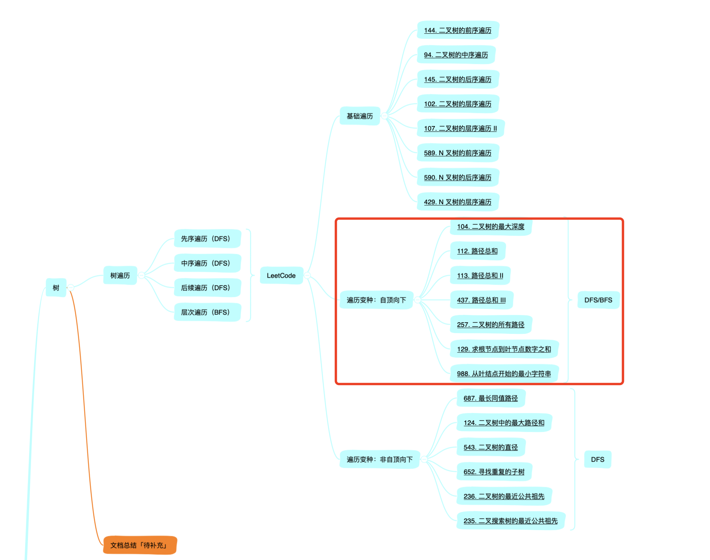
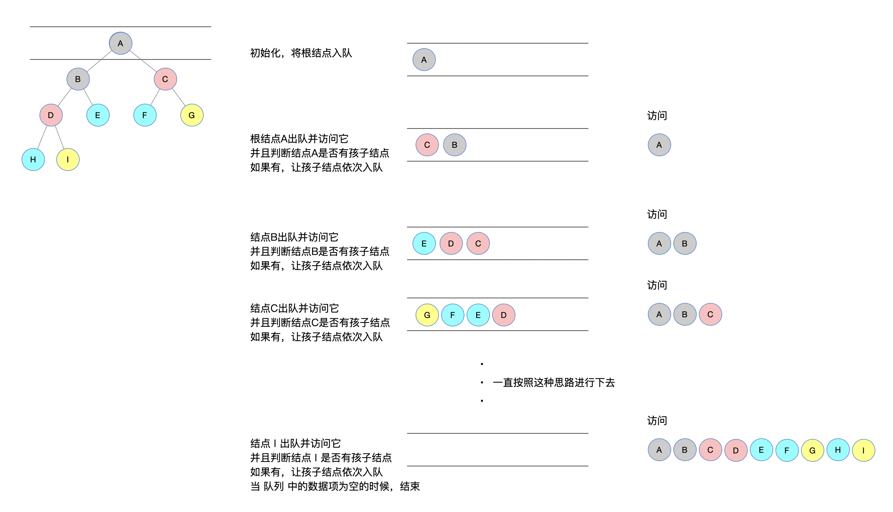

[toc]


大家好！ 

这篇文章是「讲透树」的第 3 篇文章，也是「树」专题中自顶向下这类题目的一个总结。

还是直观的先看看本文的所处的一个进度。





基本上，绝大多数关于「树」的题目，会有很大一类属于「自顶向下」类型的。

什么意思？就是计算结果的时候，通常会涉及从树根到叶子节点的计算过程，比如说最大深度、路径总和、从根结点到叶子结点的所有路径等等，都属于「自顶向下」这类题目。

104.二叉树的最大深度: https://leetcode-cn.com/problems/maximum-depth-of-binary-tree
112.路径总和: https://leetcode-cn.com/problems/path-sum
113.路径总和 II: https://leetcode-cn.com/problems/path-sum-ii
437.路径总和 III: https://leetcode-cn.com/problems/path-sum-iii
257.二叉树的所有路径: https://leetcode-cn.com/problems/binary-tree-paths
129.求根节点到叶节点数字之和: https://leetcode-cn.com/problems/sum-root-to-leaf-numbers
988.从叶结点开始的最小字符串: https://leetcode-cn.com/problems/smallest-string-starting-from-leaf

然后这类题目的解决方法基本又会有两类：

> 第一类：BFS，广度优先，利用层次遍历的方式进行解决
>
> 第二类：DFS，深度优先，利用前中后序遍历树的方式进行问题的解决

既然先说的 BFS，咱们就从 BFS 先说起，后面再描述 DFS 的解决方式。


## BFS

回忆一下经典二叉树的层序遍历问题，把需要的图放出来先看看。



很简单的一个过程。循环判断队列 queue 中是否有元素，如果有，访问该元素并且判断该结点元素是否有孩子结点，如果有，孩子结点依次入队 queue，否则，继续循环执行。

再来看看代码：

```python
res = []
while queue:
    node = queue.pop()
    res.append(node.val)
    if node.left:
        queue.appendleft(node.left)
    if node.right:
        queue.appendleft(node.right)
```

现在想要抛出几个问题，看是否可以很容易就解答。

> 问题一：遍历过程中能否记录根结点到当前结点的一些信息
>
> 包括：
>
> 1、根结点到当前结点的路径
>
> 2、根结点到当前结点的路径和

把上述图中结点中的字母对应为数字，达到**问题一**中的要求情况，看下图：


在遍历过程中，不断的进行结点值【包括结点对象、根结点到当前结点路径、根结点到当前结点路径和】的记录。

> node 表示结点对象
> node_path 表示根结点到当前结点路径
> node_val 表示根结点到当前结点路径和
> Python 中使用元祖进行表示结点的三元素信息：(node, node_path, node_val)

代码实现：

```python
res = []

while queue:
    node, node_path, node_val = queue.pop()
    res.append((node, node_path, node_val))
    if node.left:
        queue.appendleft(node.left)
    if node.right:
        queue.appendleft(node.right)
```

这样，


## DFS 


